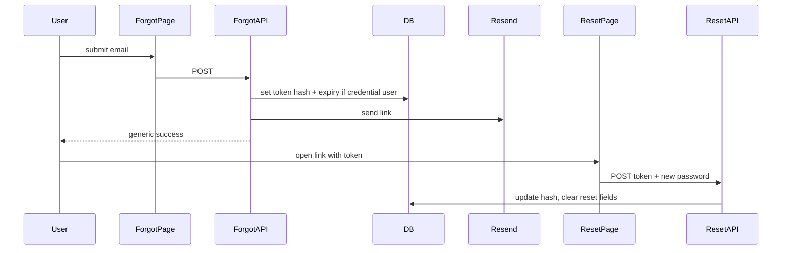

# Forgot password, GSC verification, and SEO infrastructure

## Phased delivery (one at a time)

Do **not** land everything in a single change set. After each phase: build or smoke-test, deploy if needed, then move on.


| Order | Phase                                     | What ships                                                                                                                                                             |
| ----- | ----------------------------------------- | ---------------------------------------------------------------------------------------------------------------------------------------------------------------------- |
| 1     | **GSC verification**                      | Only `verification.google` in [app/layout.js](app/layout.js). Smallest diff; you can click **Verify** in Search Console after deploy.                                  |
| 2     | **Root layout SEO metadata**              | `metadataBase`, refined `title` / `description`, Open Graph + Twitter updated to `https://renwize.com` (still no robots/sitemap/OG image file unless already present). |
| 3     | **robots + sitemap + homepage canonical** | [app/robots.js](app/robots.js), [app/sitemap.js](app/sitemap.js), `metadata` on [app/page.js](app/page.js) for canonical.                                              |
| 4     | **Open Graph image**                      | [app/opengraph-image.js](app/opengraph-image.js) with `next/og`; point OG/Twitter image metadata at it if not already implicit.                                        |
| 5     | **Password reset — database**             | New SQL file only; you run it in Supabase before Phase 6.                                                                                                              |
| 6     | **Password reset — APIs**                 | `POST` handlers + Resend email helper (no new pages yet).                                                                                                              |
| 7     | **Password reset — UI**                   | Forgot + reset routes, [components/AuthForm.js](components/AuthForm.js) link.                                                                                          |
| 8     | *(Optional)* **Dashboard noindex**        | [app/dashboard/layout.js](app/dashboard/layout.js) with `robots: { index: false, follow: false }`.                                                                     |


You can reorder **2–4** slightly (e.g. OG image before robots) if you prefer, but keep **1** first and **5 → 6 → 7** in order for forgot-password.

---

## Context from the codebase

- Auth is [auth.js](auth.js) (Credentials + Google). Password users live in Supabase `public.users` with `password_hash` ([signup route](app/api/auth/signup/route.js)). Google-created rows are upserted without a password hash, so **only users with a non-null `password_hash` should receive a reset email** (others can still get the same generic success message to avoid account enumeration).
- The auth UI is [components/AuthForm.js](components/AuthForm.js) on [app/auth/page.js](app/auth/page.js).
- Root metadata already exists in [app/layout.js](app/layout.js) but uses `**https://www.renwize.com`** and points Open Graph / Twitter at `**/og-image.png`**, which **does not exist** in [public/](public/) (no PNGs in the repo). That should be fixed as part of “SEO works well” and share previews.
- The project is **JavaScript-only** ([AGENTS.md](AGENTS.md)). You asked for `app/robots.ts`; the equivalent is `**app/robots.js`** (same Next.js API). Same for sitemap: `**app/sitemap.js`**.
- App URL for redirects already uses `**NEXT_PUBLIC_APP_URL`** ([app/api/payments/initiate/route.js](app/api/payments/initiate/route.js)). Reset links should use the same variable so local dev works; **set production to `https://renwize.com`** (per your requirement).

---

## 1. Forgot password flow

*(Phases 5–7 in the table above.)*

**Database (Supabase):** Add nullable columns on `public.users`, e.g. `password_reset_token_hash` (text) and `password_reset_expires_at` (timestamptz). Ship a small repeatable SQL file alongside [add_users_phone_number.sql](add_users_phone_number.sql) and run it in the Supabase SQL editor.

**Token handling:** Generate a cryptographically random token (e.g. 32 bytes hex). **Store only a hash** (e.g. SHA-256 of the token) and an expiry (e.g. 1 hour). Put the **raw token only in the email link** (never store raw in DB).

**API routes (Route Handlers):**

- `POST /api/auth/forgot-password` — body: `{ email }`. Normalize email like signup. If a user exists **and** `password_hash` is set: write hash + expiry, send email via Resend (`RESEND_API_KEY`, `RESEND_FROM_EMAIL`, same as [lib/reminders.js](lib/reminders.js)). **Always** return a neutral JSON success (e.g. “If an account exists, we sent instructions”) with `200` to avoid leaking which emails exist.
- `POST /api/auth/reset-password` — body: `{ token, password }`. Validate password length (match signup: ≥ 8). Look up user by comparing **hash(token)** to stored hash, check expiry, `bcrypt.hash` new password, update `password_hash`, **clear** reset fields. Return appropriate errors for invalid/expired token without revealing extra detail.

**Email:** Short HTML (or reuse a tiny helper next to [lib/emailTemplate.js](lib/emailTemplate.js)) with a single CTA link:  
`${NEXT_PUBLIC_APP_URL}/auth/reset-password?token=...`  
(Implement the path below; name can be `reset-password` to match your wording.)

**Pages:**

- `app/auth/forgot-password/page.js` — email-only form posting to the forgot-password API; same logged-in redirect pattern as [app/auth/page.js](app/auth/page.js) (`auth()` then `redirect("/dashboard")`).
- `app/auth/reset-password/page.js` — read `token` from `searchParams`; client form for new password + confirm calling reset API; handle missing token with clear UX.

**UI wiring:** In [components/AuthForm.js](components/AuthForm.js), when **Log In** is active (`!isSignup`), add a “Forgot password?” link to `/auth/forgot-password`.

**Do not change** [auth.js](auth.js) unless you discover a concrete bug; reset is orthogonal to NextAuth Credentials `authorize`.




---

## 2. Google Search Console verification meta

*(Phase 1 only — do this first, alone.)*

Use the **Next.js Metadata API** on the root layout so the tag is emitted in `<head>` correctly (equivalent to your snippet):

In [app/layout.js](app/layout.js), add:

```js
verification: {
  google: "3fZvPmudiTzMOI4O82tKluiYDhMyJ1UUw1c-IeEdi7Q",
},
```

This applies site-wide (normal for domain verification). **After deploy**, open Search Console and click **Verify** for the property that matches how users reach the site (`**https://renwize.com`** vs `www` — align with your Vercel redirect and GSC property).

---

## 3. SEO infrastructure (`https://renwize.com` only)

*(Spread across Phases 2–4, and optional Phase 8.)*

| Item                           | Action                                                                                                                                                                                                                                                                                                                |
| ------------------------------ | --------------------------------------------------------------------------------------------------------------------------------------------------------------------------------------------------------------------------------------------------------------------------------------------------------------------- |
| **Canonical base**             | Set `metadataBase: new URL("https://renwize.com")` in [app/layout.js](app/layout.js) so relative `icons` / `openGraph` paths resolve to the apex domain.                                                                                                                                                              |
| **Global title / description** | Refine `title` (e.g. `default` + `template` for child pages) and `description` so they clearly describe subscription tracking + reminders (Naira/USD), consistent with the product.                                                                                                                                   |
| **Open Graph / Twitter**       | Update `openGraph` and `twitter` to use `**https://renwize.com`** (not `www`) for `url`, `images`, etc.                                                                                                                                                                                                               |
| `**app/robots.js`**            | `export default function robots()` returning `rules: { userAgent: "*", allow: "/" }` and `sitemap: "https://renwize.com/sitemap.xml"`. Optionally set `host: "https://renwize.com"`.                                                                                                                                  |
| `**app/sitemap.js`**           | `export default function sitemap()` returning **public** URLs only: `/`, `/auth`, `/pricing`, `/privacy`, `/terms` (and the new `/auth/forgot-password` if you want it discoverable—optional). Omit `/dashboard/`* so you are not advertising gated URLs as primary landing targets.                                  |
| **Homepage canonical**         | Export `metadata` from [app/page.js](app/page.js) with `alternates.canonical: "https://renwize.com"` so the canonical is not inherited incorrectly by every route (avoid putting a single global canonical on the root layout).                                                                                       |
| **Open Graph image**           | Implement `**app/opengraph-image.js`** using `ImageResponse` from `next/og` (Next.js-supported) so `/opengraph-image` is real and OG/Twitter images work without committing a binary PNG **or** add a real `public/og-image.png` and keep metadata pointing at it. Prefer **file-based OG** so the repo stays honest. |
| **Favicon / share icon**       | Keep `icons` in metadata; with `metadataBase` set to `https://renwize.com`, `/favicon.svg` becomes the correct absolute URL. Link previews still rely primarily on **OG image**; fixing OG fixes “broken” shares.                                                                                                     |


**Optional but good for SEO hygiene:** Add `app/dashboard/layout.js` exporting `metadata.robots = { index: false, follow: false }` so authenticated areas are not indexed if crawlers ever see them.

**Env / ops:** Document in your own checklist (no new markdown file unless you ask): set `**NEXT_PUBLIC_APP_URL=https://renwize.com`** on Vercel so payment redirects, OG defaults, and password-reset emails stay consistent with the apex domain.

---

## Risk / compatibility

- **No changes** to [proxy.js](proxy.js) or NextAuth route handler beyond new API routes under `app/api/auth/...`.
- **Supabase migration** is required before forgot-password works in production.
- **Resend** must be able to send to real user inboxes in production (verified domain), same constraint as reminders.

